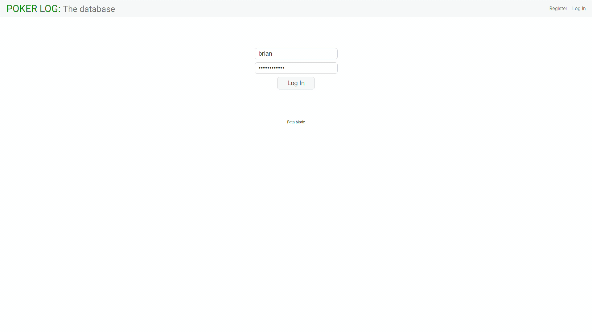
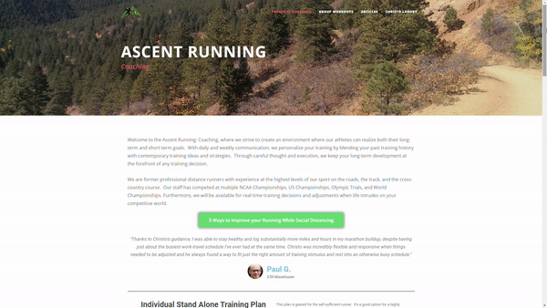

<h1 align="center">Hi, I'm Chisto Landry   

</h1>

I'm a passionate full stack developer from Charlotte, NC.  I was a professional runner (6x National Champion, 4x Team USA member, and former American Record Holder), a coach, and I've started my own coaching business and running camp.  I've built and deployed many websites and now I want to bring my focus, discipline, and drive to build products for a company that matches my passion.
<!-- I've built and deployed many full-stack applications, including an app that creates individually tailed training plans for runners, spending less time worrying about handwritten notebooks and more time focusing on what they love. I want to bring my focus, discipline, and drive to build products for a company that matches my passion. -->

  
  
  
  

<table bordercolor="#32CD32">
        <tr>
            <td width="50%" valign="top">
                <h3 align="center">Training Plan Generator</h3>
                 
                    
                 
                

                     
                

                
Full-stack web app that automatically generates individually tailored training plans for runners

            </td>
            <td width="50%" valign="top">
                <h3 align="center">Poker Log</h3>
                 
                    
                 
                

                    
                

                
Full stack web app that tracks all player's profit & losses automatically upon upload of a ledger file

            </td>
        </tr>
        <tr>
            <td width="50%" valign="top">
                <h3 align="center">Charlotte Astrophiles</h3>
                 
                    
                 
                

                     
                    
                
Website using multi space related API's to bring current content

            </td>
            <td width="50%" valign="top">
                <h3 align="center">Happy Tails Dog Grooming</h3>
                 
                    
                 
                

                    
                    
                

                
Website for a dog groomer

            </td>
        </tr>
        <tr>
            <td width="50%" valign="top">
                <h3 align="center">Professional Runner</h3>
                 
                    
                 
                

                    
                
Personal Website as a professional runner

            </td>
            <td width="50%" valign="top">
                <h3 align="center">Ascent Running Camp</h3>
                 
                    
                 
                

                    
                    
                

                
Summer running camp for high school athletes

            </td>
        </tr>
        <tr>
            <td width="50%" valign="top">
                <h3 align="center">Ascent Running Coaching</h3>
                 
                    
                 
                

                    
                
Coaching for runners

            </td>
            <td width="50%" valign="top">
                <h3 align="center">Portfolio</h3>
                 
                    
                 
                

                    
                    
                

                
Personal portfolio page

            </td>
        </tr>
    </table>

<h3 align="center">Connect with me:</h3>

<h3 align="center">Languages and Tools:</h3>

         

